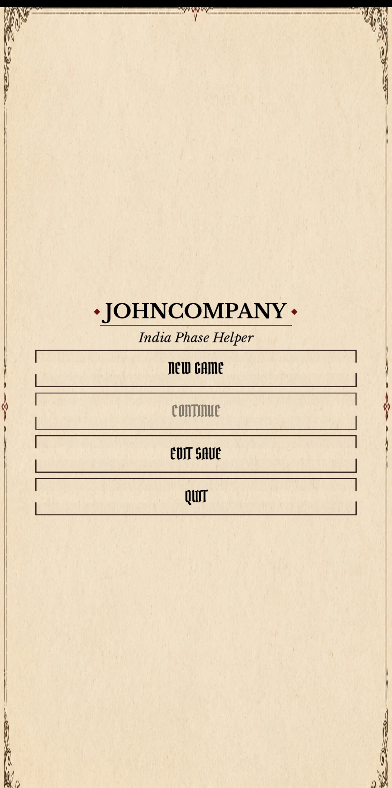
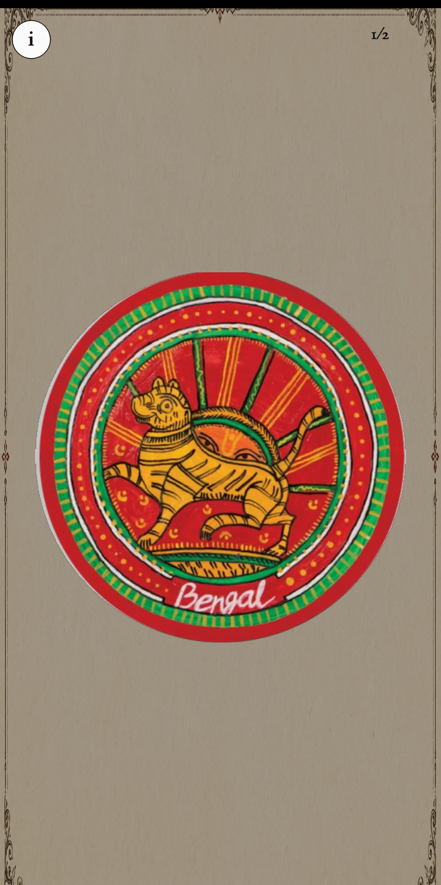
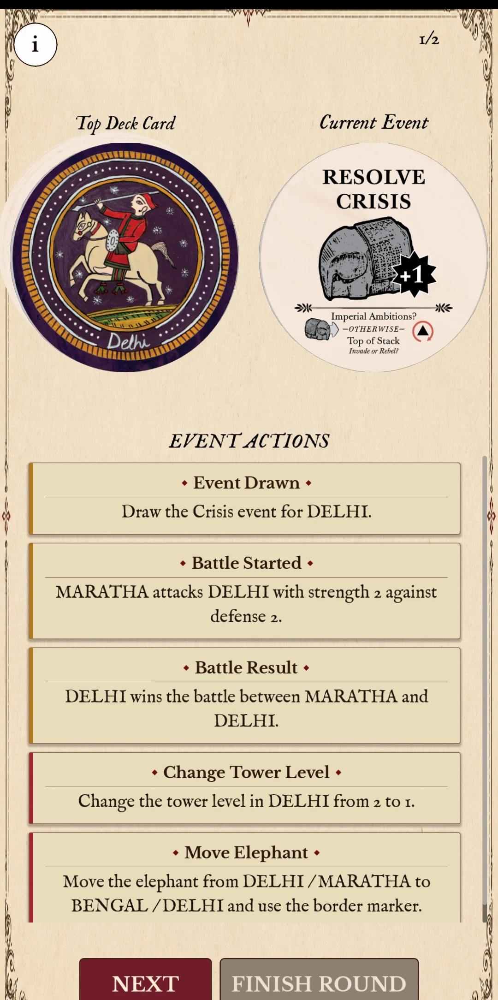
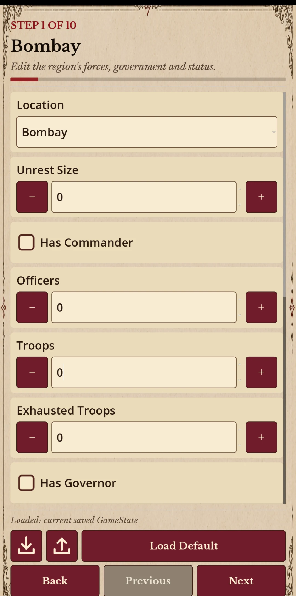

# Unofficial John Company Helper

<p align="center">
  
</p>

<p align="center">
  <a href="https://github.com/maxiking445/johnCompanyHelper/actions/workflows/godot-ci.yml">
	
  </a>
  <a href="https://github.com/maxiking445/johnCompanyHelper/actions/workflows/release.yml">
	
  </a>
  <br>
  
  
  
</p>

> [!WARNING]
This project is still in active testing.
Some features may be incomplete, and bugs or incorrect rule resolutions can occur. Please verify important game decisions against the official John Company rules.

John Company Helper is a small companion application for resolving the India
Phase in **John Company**. It keeps track of the current game state, guides the
players through event cards, and helps apply the resulting rules in the correct
order.

The project is designed to reduce bookkeeping and errors while speeding up the India Phase at the table—not to
  replace the board game or its rulebook.

## Screenshots

Android Screens:

<table align="center">
  <tr>
	<td><p align="center"><strong>Main menu</strong></p><p align="center"></p></td>
	<td><p align="center"><strong>Event card</strong></p><p align="center"></p></td>
  </tr>
  <tr>
	<td><p align="center"><strong>Event actions</strong></p><p align="center"></p></td>
	<td><p align="center"><strong>State editor</strong></p><p align="center"></p></td>
  </tr>
</table>

## Project status and feedback

John Company Helper is still in an early stage and has not yet been thoroughly
tested during live games. Rule interactions, unusual game states, and platform
specific issues may therefore still cause incorrect results or other bugs.

Bug reports, rule corrections, and general feedback are very welcome. Please
[open an issue](https://github.com/maxiking445/johnCompanyHelper/issues) and
include the game state, the expected result, and the steps required to reproduce
the problem whenever possible.
  

## Download and usage

Download the newest build from the
[latest GitHub Release](https://github.com/maxiking445/johnCompanyHelper/releases/latest).

### Windows

1. Download `JohnCompanyHelper-vX.Y.Z-windows-x86_64.exe`.
2. Double-click the downloaded file.
3. If Windows SmartScreen warns about the unsigned application, select
   **More info** and then **Run anyway** if you trust the download.

No installation is required.

### Linux

1. Download `JohnCompanyHelper-vX.Y.Z-linux-x86_64`.
2. Open a terminal in the download directory.
3. Make the file executable and start it:

   ```sh
   chmod +x JohnCompanyHelper-vX.Y.Z-linux-x86_64
   ./JohnCompanyHelper-vX.Y.Z-linux-x86_64
   ```

The Linux build targets x86_64 desktop systems.

### macOS

1. Download `JohnCompanyHelper-vX.Y.Z-macos-universal.zip`.
2. Extract the archive and move `JohnCompanyHelper.app` to the
   `Applications` folder.
3. Open the application. If macOS blocks the unsigned application, open
   **System Settings > Privacy & Security** and select **Open Anyway** only if
   you trust the download.

The macOS build is universal and supports both Apple Silicon and Intel Macs.


## Disclaimers

This is an unofficial fan project. It is not affiliated with, endorsed by, or
supported by the designers, publishers, or rights holders of *John Company*.
All names, artwork, trademarks, and other material belonging to the board game
remain the property of their respective owners. A copy of the board game is
required to use this companion.

Because I love the board games artwork, I used it as inspiration and remixed parts of it with the help of
generative AI to create some of the UI elements in this project. AI tools also supported parts of the
development process, while the game-rule logic and test suite were mostly written, reviewed, and maintained by me.

## Development

Development requires [Godot Engine 4.7.1](https://godotengine.org/) or a
compatible newer version. Clone the repository and import `project.godot` into
the Godot Project Manager.

The repository includes the add-ons used by the project, most notably
[ResourceJSON](https://github.com/maxiking445/godot-resource-json) for JSON
conversion and [GUT](https://github.com/bitwes/Gut) for automated tests. These
dependencies are only relevant when modifying or testing the project; users of
the downloadable builds do not need to install them.

## License

The source code is available under the [MIT License](LICENSE).
